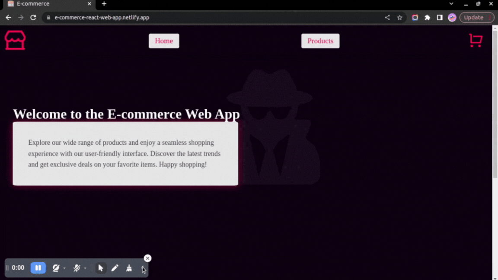
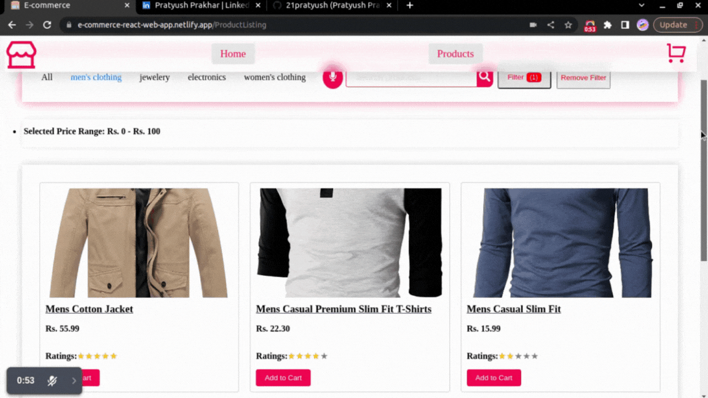
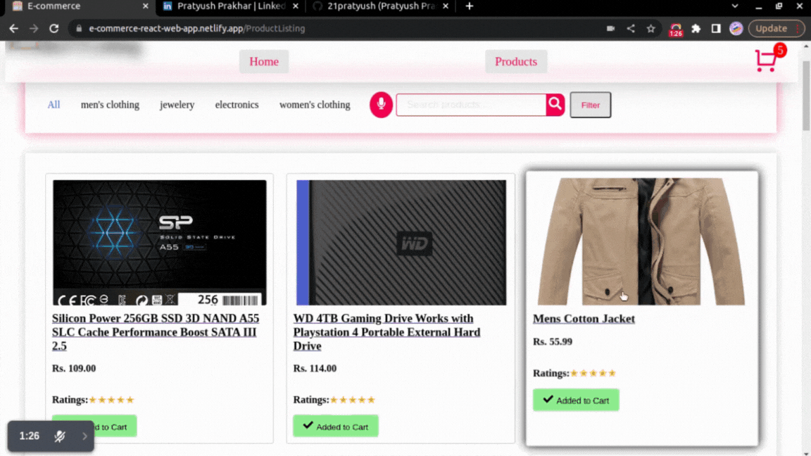
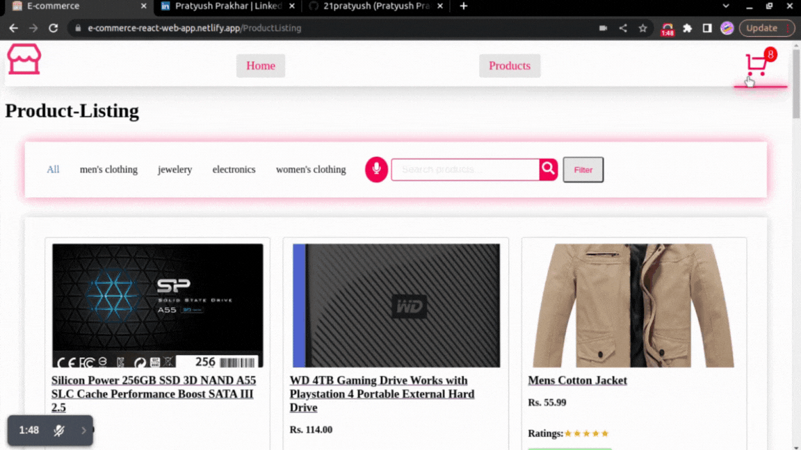

# E-commerce web-app [](https://e-commerce-react-web-app.netlify.app/)


This project is only for hands-on React and Docker practice and learning.  ⚛️ 🐳 💻

## Table of Contents 📚

1. 🚀 [Getting Started](#getting-started)
   - 📋 [Prerequisites](#prerequisites)
   - 🛠️ [Installation](#installation)
   - 🚀 [Usage](#usage)
2. 💡 [Features](#features)
3. 🌐 [Live Demo](#live-demo)
4. 🖼️ [Screenshots](#screenshots)
5. ⚙️ [Technologies Used](#technologies-used)
6. 🤝 [Contributing](#contributing)
7. 📞 [Contact](#contact)


## 🚀 Getting Started

### Prerequisites

Before running the project, ensure that you have the following software installed:

- 🟩 Node.js ```v18.9.0 ```
- 📦 NPM ```9.6.7```


### Installation

To set up the project, follow these steps: 👨‍💻

1. Clone the repository:

```bash
git clone https://github.com/21pratyush/React_E-commerce_Web-app.git
```
```bash
git clone git@github.com:21pratyush/React_E-commerce_Web-app.git
```
2. Navigate to the project directory:
```bash
cd React_E-commerce_Web-app
```
3. Install the dependencies:
```bash
npm install
```

## Usage
1. To start the development server, run the following command:

```bash
npm start
```
2. Open your web browser and go to ```http://localhost:3000``` to view the app.

## 🐳 Docker
If you have Docker installed, you can also run the app in a Docker container. 

- Follow these steps
1. Pull the Docker image from Docker Hub:
```bash
docker pull pratyush21/react-ecommerce
```
2. Run the app in a Docker container:
```bash
docker run -d -p 3000:80 pratyush21/react-ecommerce
```
- Open your web browser and go to ```http://localhost:3000``` to view the app.

## 💡Features

List the main features of your web app, such as:

- Home-page with decent introduction
- Product-listing-page with 
   - Searching  🔍
   - Voice-search   🗣️🎤
   - Sorting ⬆️⬇️
   - Filtering 🔖
- Product detail page with product information and related products
- Shopping cart page for adding and managing items

## 🌟Live Demo

Check out the live demo of the app:

[](https://e-commerce-react-web-app.netlify.app/)


## Screenshots 📸

A glimpse of my web-app through the following GIFs.

### Home-Page
 
### Product_Listing-Page

### Product_Details-Page

### Cart-Page


## 🛠️ Technologies-Used

- ⚛️ React.js
- 🌐 React Router
- ✨ React Spring
- 💅 Styled Components (CSS-in-JS library)
- 🛒 Cart Context


## 🤝 Contributing  

If you want to contribute to the project, follow these steps:

- 🍴 Fork the repository
- 🌿 Create a new branch
- 🛠️ Make changes and commit them
- 🔀 Open a pull request


## Contact

- Feel free to reach out to me via

[](https://www.linkedin.com/in/pratyush-prakhar-149217241/) 
[](mailto:pratyush.prakhar21@gmail.com)
